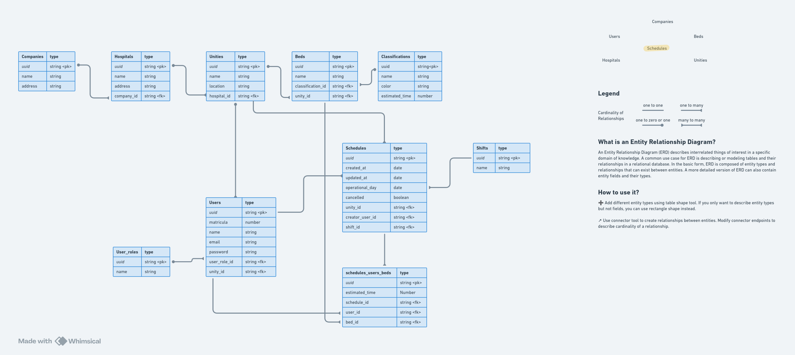
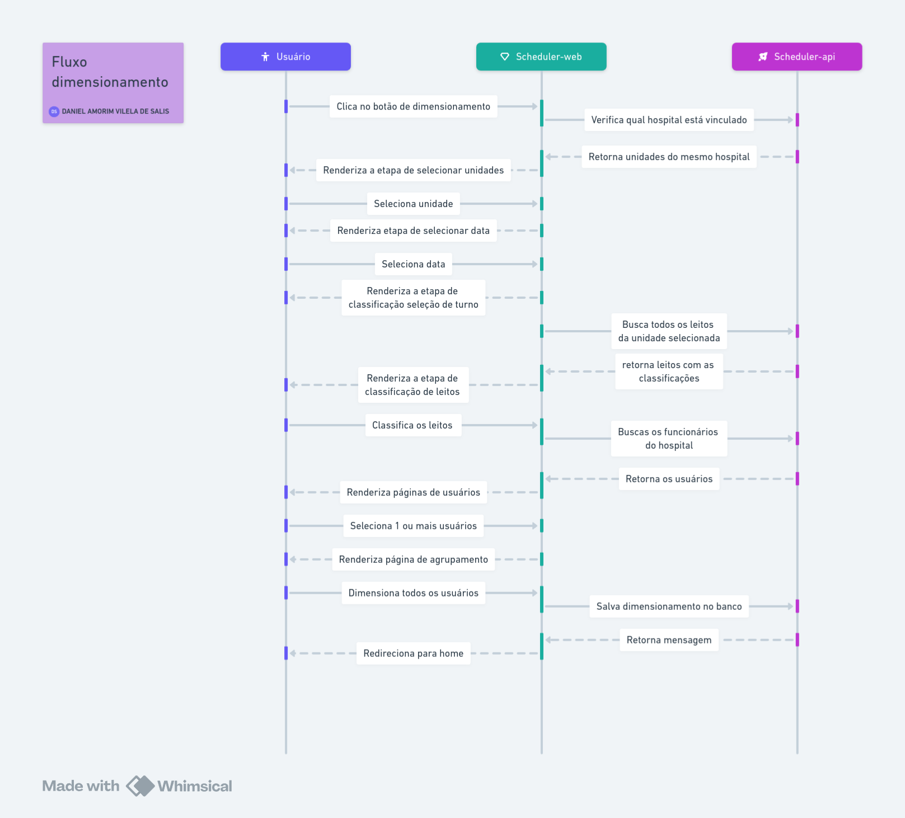
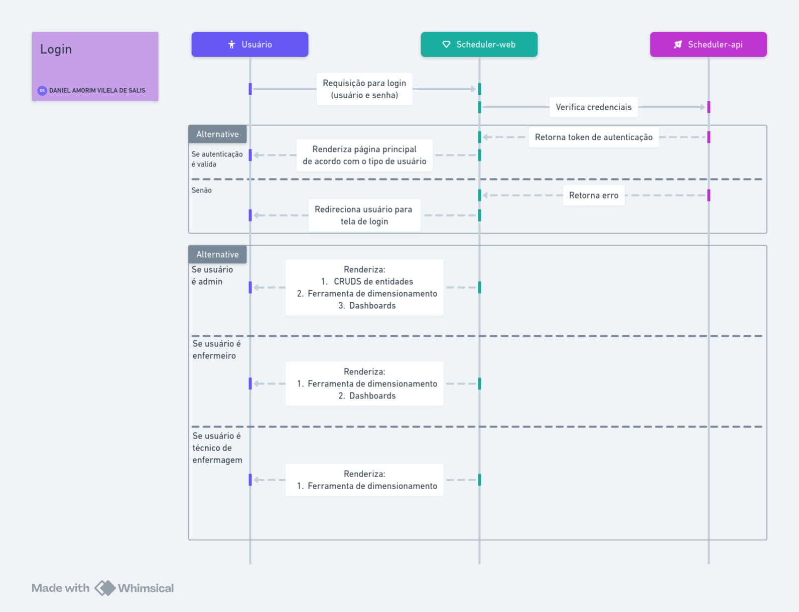
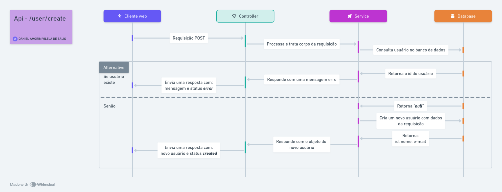

# the-scheduler-api

Backend repo for de nurse scheduling app from my University conclusion project

## How to run

- npm install
- npx prisma init

## Documentation

Images

### More info into the assets folder

* Api Overview

* Database diagram

* Scheduling general sequence diagram

* Login sequence diagram

* Login sequence diagram

* user/create api aroute sequence diagram

